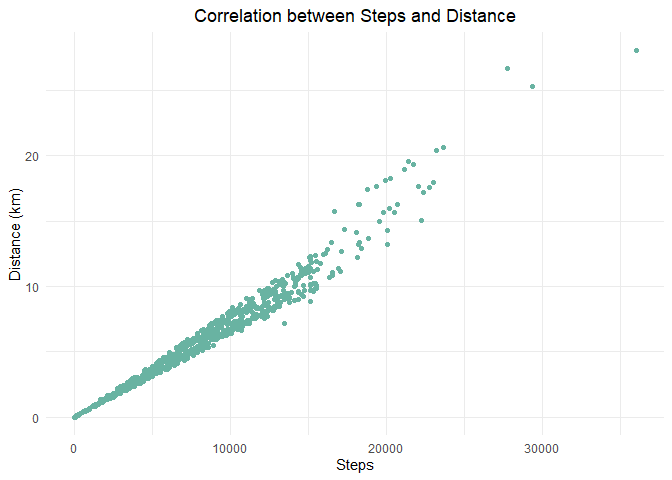
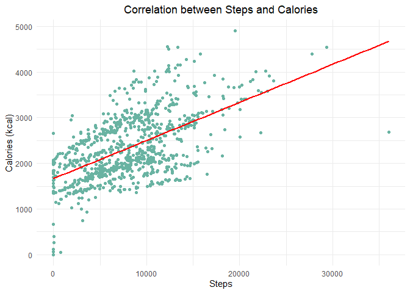
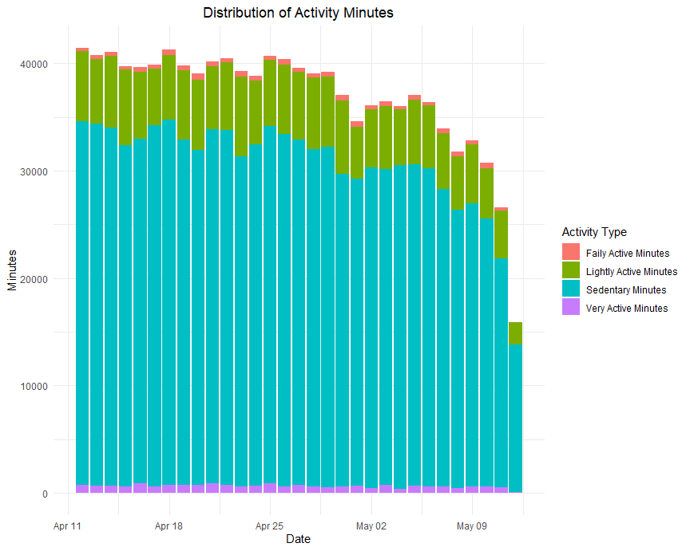
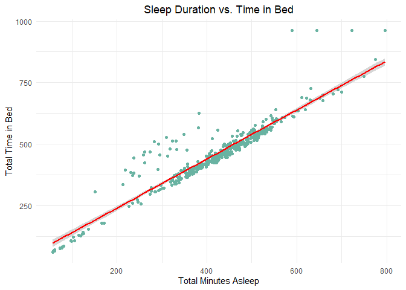
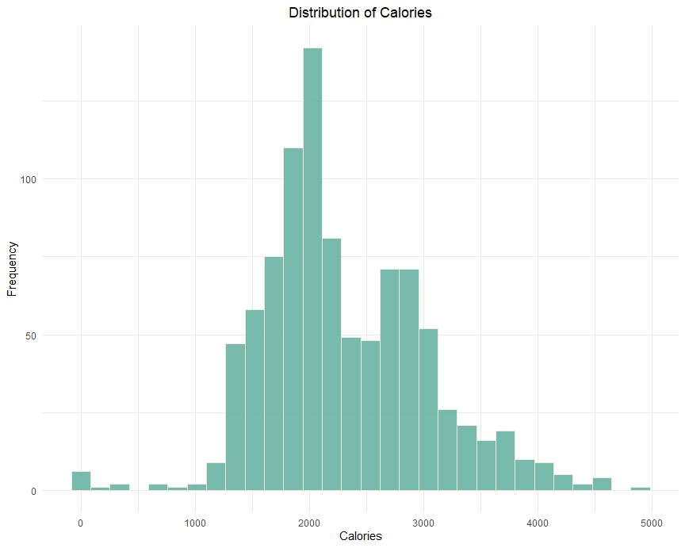
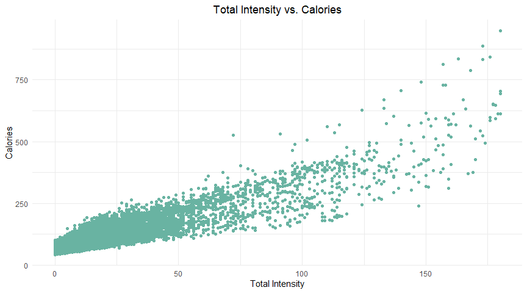

Bellabeat Analysis
================
Luis Figueroa
2023-08-05

## How Can a Wellness Techonology Company Play It Smart?

The insights gained from analyzing smart device usage data can drive
various business decisions for Bellabeat. By understanding how consumers
are using their smart devices, the company can identify patterns,
trends, and preferences. These insights can inform product development,
marketing campaigns, and overall business strategy.

The **business task** at hand is to analyze the smart device usage data
for one of Bellabeat’s products and derive meaningful insights. The
analysis should identify how consumers are utilizing the smart device
and provide recommendations on how these trends can inform Bellabeat’s
marketing strategy. The objective is to leverage the data to drive
business growth, improve customer satisfaction, and strengthen
Bellabeat’s position in the smart device market.

### Data Cleaning and Preparation

``` r
# Read csv files
dailyActivity <- read.csv("../dailyActivity.csv")
dailyIntensities <- read.csv("../dailyIntensities.csv")
sleepDay <- read.csv("../sleepDay.csv")
weightLogInfo <- read.csv("../weightLogInfo.csv")
hourlyCalories <- read.csv("../hourlyCalories.csv")
hourlyIntensities <- read.csv("../hourlyIntensities.csv")
```

In the Bellabeat case study, the data sources used for analysis include
18 CSV files containing information related to smart device usage and
participant data; however, 6 csv files will be used for this analysis.
Each CSV file represents a unique data source, and they are joined based
on a common unique ID column. These files likely contain data collected
from Bellabeat’s various smart devices, such as the Leaf tracker, Time
watch, and Spring water bottle. The data within the files include
metrics related to activity, sleep, and other health-related parameters.
While specific details about the data sources, such as the data
collection methods or demographics, are not provided, these files serve
as the primary sources of information for analyzing how consumers are
using Bellabeat’s smart devices.

The chosen tool for analysis is R. Upon inspecting the data sets, it was
observed that the date column is in character format. In order to work
with dates accurately, we transformed the data type from character to
date format using the lubridate library. However, it is important to
note that the CSV files used for analysis do not have an equal number of
unique participants.

We should note that this data has **one** month worth of data dating
from 2016-04-12 to 2016-05-12.

``` r
# Check the number of unique participants per data frame
n_distinct(dailyActivity$Id)      # 33 participants
```

    ## [1] 33

``` r
n_distinct(sleepDay$Id)           # 24 participants
```

    ## [1] 24

``` r
n_distinct(weightLogInfo$Id)      # 08 participants
```

    ## [1] 8

``` r
n_distinct(hourlyCalories$Id)     # 33 participants
```

    ## [1] 33

``` r
n_distinct(hourlyIntensities$Id)  # 33 participants
```

    ## [1] 33

``` r
n_distinct(dailyIntensities$Id)   # 33 participants
```

    ## [1] 33

``` r
# Convert dates from char to date type
dailyActivity$ActivityDate <- mdy(dailyActivity$ActivityDate)
dailyIntensities$ActivityDay <- mdy(dailyIntensities$ActivityDay)
sleepDay$SleepDay <- mdy_hms(sleepDay$SleepDay)
weightLogInfo$Date <- mdy_hms(weightLogInfo$Date)
hourlyCalories$ActivityHour <- mdy_hms(hourlyCalories$ActivityHour)
hourlyIntensities$ActivityHour <- mdy_hms(hourlyIntensities$ActivityHour)
```

The files used in the analysis are as follows:

1.  **dailyActivity**: This file contains daily totals for steps,
    intensity, distance, and calories. It includes data from 33 unique
    participants.
2.  **SleepDay**: This file contains data from each tracked sleep event.
    It involves 24 unique participants.
3.  **weightLogInfo**: This file contains data values related to each
    tracked weight measurement. It includes information from 8 unique
    participants.
4.  **dailyIntensities**: This file represents the time spent in four
    intensity categories, namely sedentary activity, light activity,
    moderate activity, and very active activity. It involves data from
    33 unique participants.
5.  **hourlyCalories**: This file provides estimated energy expenditure
    information. It involves 33 unique participants.
6.  **HourlyIntensities**: This file indicates the time spent in one of
    four intensity categories on an hourly basis. It also includes data
    from 33 unique participants.

### Analysis: Summary Statistics

Let’s first analyze **total steps**, **total distance** and **calories**
burned from the **dailyActivty** table using the summary function.

|     | TotalSteps    | TotalDistance  | Calories     |
|:----|:--------------|:---------------|:-------------|
|     | Min. : 0      | Min. : 0.000   | Min. : 0     |
|     | 1st Qu.: 3790 | 1st Qu.: 2.620 | 1st Qu.:1828 |
|     | Median : 7406 | Median : 5.245 | Median :2134 |
|     | Mean : 7638   | Mean : 5.490   | Mean :2304   |
|     | 3rd Qu.:10727 | 3rd Qu.: 7.713 | 3rd Qu.:2793 |
|     | Max. :36019   | Max. :28.030   | Max. :4900   |

We can observe the following insight:

- **TotalSteps**: The minimum number of steps recorded is 0, indicating
  that there are instances where no steps were taken. The median value
  is 7,406, indicating that the middle value of step counts falls around
  this range. The maximum number of steps recorded is 36,019.

- **TotalDistance**: The minimum recorded distance is 0.000, indicating
  instances where no distance was covered. The median distance is 5.245,
  indicating that the middle value of distance covered falls around this
  range. The maximum recorded distance is 28.030.

- **Calories**: The minimum number of calories burned is 0, indicating
  instances where no calories were burned. The median calorie count is
  2,134, indicating that the middle value of calories burned falls
  around this range. The maximum number of calories burned is 4,900.

The data clearly demonstrates a positive correlation between the number
of steps taken by participants, the distance traveled, and the calories
burned. As the step count increases, there is a noticeable increase in
both the distance covered and the calories expended. This indicates a
direct relationship between physical activity levels and these metrics.

``` r
# Scatter plot: total steps vs distance
ggplot(dailyActivity, aes(x = TotalSteps, y = TotalDistance)) +
  geom_point(color = "#69b3a2") + 
  labs(title = "Correlation between Steps and Distance", 
       x = "Steps", 
       y = "Distance (km)") +
theme(plot.title = element_text(hjust = 0.5))
```

<!-- -->

``` r
# Scatter plot: total steps vs calories
ggplot(dailyActivity, aes(x = TotalSteps, y = Calories)) + 
  geom_point(color = "#69b3a2") +
  geom_smooth(method = "lm", se = FALSE, color = "red") +
  labs(title = "Correlation between Steps and Calories",
       x = "Steps", 
       y = "Calories (kcal)") +
  theme(plot.title = element_text(hjust = 0.5))
```

    ## `geom_smooth()` using formula = 'y ~ x'

<!-- -->

Now, let’s analyze the different types of intensities

|     | VeryActiveDistance | ModeratelyActiveDistance | LightActiveDistance | SedentaryActiveDistance |
|:----|:-------------------|:-------------------------|:--------------------|:------------------------|
|     | Min. : 0.000       | Min. :0.0000             | Min. : 0.000        | Min. :0.000000          |
|     | 1st Qu.: 0.000     | 1st Qu.:0.0000           | 1st Qu.: 1.945      | 1st Qu.:0.000000        |
|     | Median : 0.210     | Median :0.2400           | Median : 3.365      | Median :0.000000        |
|     | Mean : 1.503       | Mean :0.5675             | Mean : 3.341        | Mean :0.001606          |
|     | 3rd Qu.: 2.053     | 3rd Qu.:0.8000           | 3rd Qu.: 4.782      | 3rd Qu.:0.000000        |
|     | Max. :21.920       | Max. :6.4800             | Max. :10.710        | Max. :0.110000          |

along with their minutes.

|     | VeryActiveMinutes | FairlyActiveMinutes | LightlyActiveMinutes | SedentaryMinutes |
|:----|:------------------|:--------------------|:---------------------|:-----------------|
|     | Min. : 0.00       | Min. : 0.00         | Min. : 0.0           | Min. : 0.0       |
|     | 1st Qu.: 0.00     | 1st Qu.: 0.00       | 1st Qu.:127.0        | 1st Qu.: 729.8   |
|     | Median : 4.00     | Median : 6.00       | Median :199.0        | Median :1057.5   |
|     | Mean : 21.16      | Mean : 13.56        | Mean :192.8          | Mean : 991.2     |
|     | 3rd Qu.: 32.00    | 3rd Qu.: 19.00      | 3rd Qu.:264.0        | 3rd Qu.:1229.5   |
|     | Max. :210.00      | Max. :143.00        | Max. :518.0          | Max. :1440.0     |

Let’s visualize the different types of intensities:

``` r
#Stacked bar chart showing the distribution of activity intensity levels
dailyActivity_segments <- dailyActivity %>%
  group_by(ActivityDate) %>%
  summarize(
    VeryActiveMinutes = sum(VeryActiveMinutes),
    FairlyActiveMinutes = sum(FairlyActiveMinutes),
    LightlyActiveMinutes = sum(LightlyActiveMinutes),
    SedentaryMinutes = sum(SedentaryMinutes)
  )

dailyActivity_long <- dailyActivity_segments %>%
  pivot_longer(
    cols = c(VeryActiveMinutes, FairlyActiveMinutes, LightlyActiveMinutes, SedentaryMinutes),
    names_to = "activityType",
    values_to = "minutes"
  )

ggplot(dailyActivity_long, aes(x = ActivityDate, y = minutes, fill = activityType)) +
  geom_bar(stat = "identity") +
  labs(title = "Distribution of Activity Minutes",
       x = "Date",
       y = "Minutes",
       fill = "Activity Type") +
  scale_fill_discrete(labels = c("Faily Active Minutes", "Lightly Active Minutes",
                                 "Sedentary Minutes", "Very Active Minutes")) + 
  theme(plot.title = element_text(hjust = 0.5))
```

<!-- -->

The majority of participants spent most of their time in sedentary
activity, followed by light activity. Only a small portion of their time
was spent in fairly active and very active activity. This suggests that
there is a significant portion of participants who engage in relatively
low-intensity activities, with fewer participants being highly active.
This information highlights the importance of promoting and encouraging
participants to increase their activity levels, particularly in the
moderate to high-intensity range, to improve overall health and fitness.

Now let’s look at **sleepDay** table

|     | TotalSleepRecords | TotalMinutesAsleep | TotalTimeInBed |
|:----|:------------------|:-------------------|:---------------|
|     | Min. :1.000       | Min. : 58.0        | Min. : 61.0    |
|     | 1st Qu.:1.000     | 1st Qu.:361.0      | 1st Qu.:403.0  |
|     | Median :1.000     | Median :433.0      | Median :463.0  |
|     | Mean :1.119       | Mean :419.5        | Mean :458.6    |
|     | 3rd Qu.:1.000     | 3rd Qu.:490.0      | 3rd Qu.:526.0  |
|     | Max. :3.000       | Max. :796.0        | Max. :961.0    |

- **TotalSleepRecords** represents the number of recorded sleep periods
  for each day, including any naps that lasted longer than 60 minutes.
  This variable provides insights into the sleep patterns and habits of
  the individual. The summary statistics reveal that the minimum and
  maximum number of sleep records are 1 and 3, respectively. On average,
  there are approximately 1.12 sleep records per day, indicating a
  relatively consistent sleep routine.

- **TotalMinutesAsleep** indicates the total number of minutes
  classified as being “asleep” for each day. This variable reflects the
  duration of restful sleep achieved by the individual. The summary
  statistics show that the minimum number of minutes asleep is 58, while
  the maximum is 796 which is about 13 hrs. The median value is 433 mins
  or about 7 hrs.

- **TotalTimeInBed** represents the total minutes spent in bed,
  including time spent asleep, restless, and awake, during a defined
  sleep record. This variable provides a measure of the overall time
  spent in bed during the sleep period. The summary statistics reveal
  that the minimum time spent in bed is 61 minutes, while the maximum is
  961 minutes or 16 hrs. The median value of 463 minutes suggests that,
  on average, the individual spends a considerable amount of time in
  bed.

``` r
# Scatter plot: Sleep Duration vs. Time in Bed
ggplot(sleepDay, aes(x = TotalMinutesAsleep, y = TotalTimeInBed)) +
  geom_point(color = "#69b3a2") +
  labs(title = "Sleep Duration vs. Time in Bed",
       x = "Total Minutes Asleep",
       y = "Total Time in Bed") +
  geom_smooth(method = "lm", color = "red") + 
  theme(plot.title = element_text(hjust = 0.5))
```

    ## `geom_smooth()` using formula = 'y ~ x'

<!-- -->

The summary analysis of the sleep-related variables indicates that the
individual tends to have around 1 sleep record per day, achieving an
average of 419.5 minutes of restful sleep. The average time spent in bed
during the sleep period is approximately 458.6 minutes.

Lastly, let’s look at **weightLogInfo** table.

|     | WeightKg       | BMI           |
|:----|:---------------|:--------------|
|     | Min. : 52.60   | Min. :21.45   |
|     | 1st Qu.: 61.40 | 1st Qu.:23.96 |
|     | Median : 62.50 | Median :24.39 |
|     | Mean : 72.04   | Mean :25.19   |
|     | 3rd Qu.: 85.05 | 3rd Qu.:25.56 |
|     | Max. :133.50   | Max. :47.54   |

Note that the results presented here are based on data from a subset of
participants. Out of the 33 unique participants, there is only
information recorded of 8 individuals, which constitutes a relatively
small sample size.

Let’s visualize the distribution of calories burned across participants
on a histogram.

``` r
# Histogram: Distribution of Calories
ggplot(dailyActivity, aes(x = Calories)) + 
  geom_histogram(fill = "#69b3a2", color = "#eceadd", alpha = 0.9) +
  labs(title = "Distribution of Calories",
       x = "Calories",
       y = "Frequency") + 
  theme(plot.title = element_text(hjust = 0.5))
```

    ## `stat_bin()` using `bins = 30`. Pick better value with `binwidth`.

<!-- -->

This distribution seems to have a bell-shaped curved.

In order to gain a more comprehensive understanding of the participants’
activity levels and the corresponding calorie expenditure, we performed
a merging of two key datasets: **hourlyCalories** and
**hourlyIntensities**

The totalIntensity variable was derived by summing up the minute-level
intensity values recorded throughout the hour. Each intensity level was
assigned a specific value, where sedentary activity was denoted as 0,
light activity as 1, moderate activity as 2, and very active activity as
3. By aggregating the intensity values in this way, we obtained a
comprehensive measure of overall activity intensity for each hour.

``` r
# Merging hourlyCalories and hourlyIntensities data frames
calories_intensities <- merge(hourlyCalories, hourlyIntensities, by = c("Id", "ActivityHour"))

# Scatter plot: Total Intensity vs. Calories
ggplot(calories_intensities, aes(x = TotalIntensity, y = Calories)) +
  geom_point(color = "#69b3a2") +
  labs(title = "Total Intensity vs. Calories",
       x = "Total Intensity", 
       y = "Calories") +
    theme(plot.title = element_text(hjust = 0.5))
```

<!-- -->

There is a positive correlation between the intensity of physical
activity and the resulting calorie expenditure. In other words, as
individuals engage in more intense physical activities, they tend to
burn a higher number of calories.

This observation suggests that the level of activity intensity plays a
significant role in determining the amount of energy expended by
individuals. As the intensity of physical activity increases, the body
requires greater effort and energy expenditure, resulting in a higher
calorie burn. This trend highlights the importance of incorporating more
vigorous activities into our daily routines to maximize the potential
for calorie burning and overall fitness.

### Recap

In this analysis, we explored the Bellabeat fitness tracker data to gain
insights into user activity patterns, sleep habits, and weight trends.
While our findings provide valuable insights, it is important to
consider the limitations of the data, which includes only one month’s
worth of data with information about 33 unique participants.

Our analysis revealed several interesting findings. We observed an
upward trend, indicating that as physical activity intensity increased,
more calories were burned. This suggests a positive relationship between
activity intensity and calorie expenditure, which can be useful for
individuals aiming to achieve their fitness goals. Additionally, we
identified a correlation between sleep duration and time spent in bed,
highlighting the importance of adequate sleep for overall well-being.

However, it is crucial to interpret these findings with caution due to
the limited sample size. For instance, the analysis of weight log was
based on data from only 8 participants out of the 33 unique individuals.
This restricts the generalization of our conclusions and limits the
extent to which we can draw meaningful insights.

Moving forward, it is recommended to expand the data set and include
data from a larger and more diverse sample of participants. This would
enhance the representation of the findings and allow for more robust
analysis. Additionally, incorporating data from a longer time period
would provide a more comprehensive understanding of user behavior and
patterns over time.

Furthermore, future analysis could explore additional variables such as
heart rate, stress levels, or dietary habits to gain a more holistic
understanding of users’ health and well-being. By incorporating these
variables, Bellabeat could offer more personalized recommendations and
insights to its users, empowering them to make informed decisions about
their lifestyle and overall fitness.

In conclusion, while our analysis of the Bellabeat fitness tracker data
offers valuable insights into user activity patterns, sleep habits, and
weight trends, it is important to recognize the limitations of the
dataset. By expanding the sample size and incorporating additional
variables, future analyses can provide a more comprehensive
understanding of users’ health and enable more precise recommendations.
Ultimately, the findings from this analysis serve as a starting point
for further exploration and research in the field of personalized
fitness and well-being.
